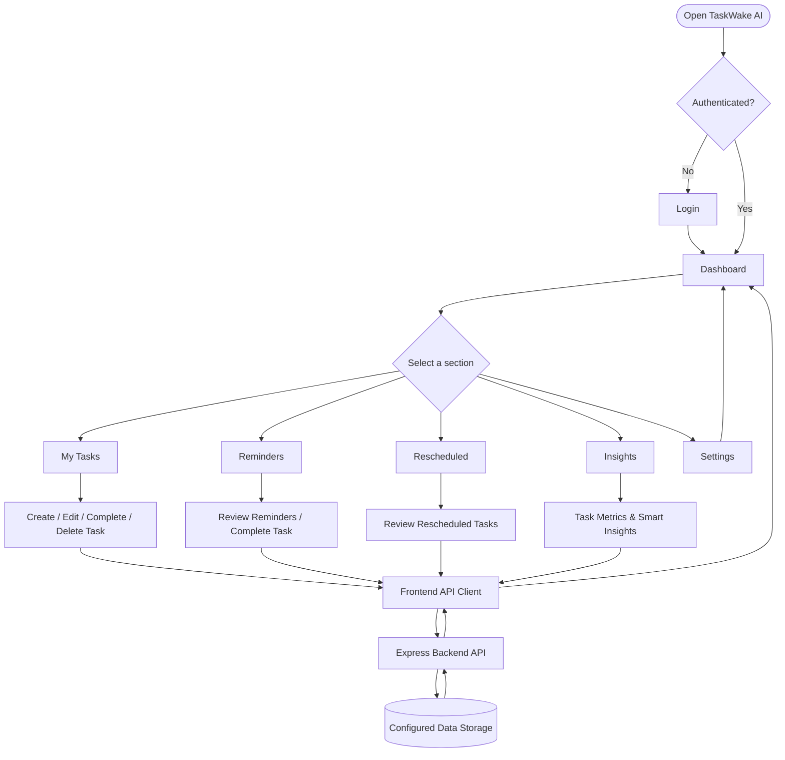
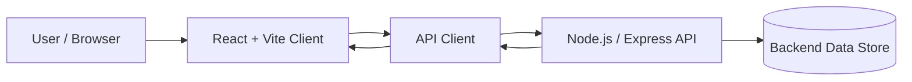

# ⏰ TaskWake AI

### Smart Task Management & Reminder Dashboard

TaskWake AI is a productivity web application designed to help users organize tasks, review reminders, track rescheduled work, and understand productivity trends from one dashboard.

> **Project status:** Active development. Some features and setup details may vary depending on the backend configuration.

## ✨ Features

- **Dashboard** — overview of tasks and productivity activity.
- **My Tasks** — create, view, edit, complete, and delete tasks.
- **Reminders** — view upcoming tasks and act on reminders.
- **Rescheduled** — review tasks whose schedules have changed.
- **Insights** — task statistics and productivity analytics, with a smart insight endpoint.
- **Settings** — dedicated settings screen.
- **Authentication** — login/logout navigation and protected task experience (subject to backend configuration).
- **Responsive interface** — React-based navigation and dashboard pages.

## 🧰 Tech Stack

| Layer | Technology |
| --- | --- |
| Frontend | React, Vite, JavaScript, JSX, CSS |
| Routing | React Router |
| API requests | Axios-based API client |
| Backend | Node.js, Express.js |
| Database | Configure according to your server implementation |

## 🔄 Application Flowchart



## 🏗️ Architecture



## 📁 Project Structure

```text
taskwake-ai/
├── client/                 # React + Vite frontend
│   ├── public/             # Static assets
│   ├── src/
│   │   ├── pages/          # Dashboard, MyTasks, Reminders, Insights, etc.
│   │   └── ...
│   └── package.json
├── server/                 # Node.js backend (adjust if named differently)
│   ├── ...
│   └── package.json
├── .gitignore
└── README.md
```

## 🚀 Run Locally

**Requirements:** Node.js and npm.

### 1. Clone the repository

```bash
git clone https://github.com/YOUR_USERNAME/taskwake-ai.git
cd taskwake-ai
```

### 2. Start the backend

```bash
cd server
npm install
npm run dev
```

> If the backend does not have a `dev` script, use the script specified in `server/package.json` (for example, `npm start`). Configure required environment variables before starting.

### 3. Start the frontend

In a second terminal:

```bash
cd client
npm install
npm run dev
```

Open the local URL displayed by Vite (commonly `http://localhost:5173`). Ensure the frontend API base URL points to the running backend.

## 🔌 API Endpoints Used by the Frontend

| Method | Endpoint | Purpose |
| --- | --- | --- |
| GET | `/tasks` | Fetch tasks |
| POST | `/tasks` | Create task |
| PUT | `/tasks/:id` | Update task |
| PATCH | `/tasks/:id/complete` | Complete task |
| DELETE | `/tasks/:id` | Delete task |
| GET | `/smart/insight` | Retrieve smart insight |

> Paths above are used by the frontend API client; its configured base URL may prepend `/api`. Verify the routes in your backend before deploying.

## 🔒 Security Notes

Do **not** upload `node_modules/`, `.env`, `.env.*` (except a sanitized `.env.example`), API keys, tokens, or database credentials to GitHub. Keep secrets in environment variables.

## 🛣️ Future Enhancements

- More detailed productivity analytics.
- Improved reminder scheduling and notifications.
- Expanded smart recommendations.
- Testing, deployment documentation, and accessibility improvements.

## 👩‍💻 Development

Built as a full-stack productivity application using React and Node.js.

---

⭐ If you find the project useful, consider starring the repository!
